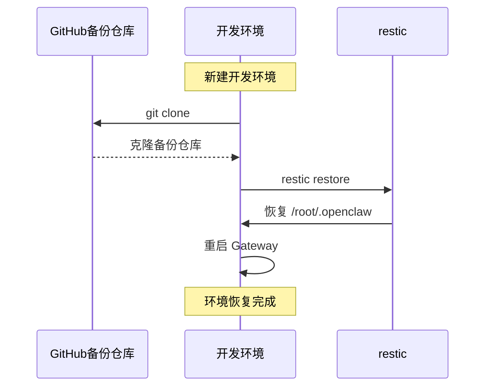

# Fork 本项目并部署到 monkeycode-ai 开发环境

本指南帮助其他用户将 OpenClaw 项目 fork 到自己的 GitHub 仓库，并在 monkeycode-ai 开发环境中部署使用。

## 目录

1. [前提条件](#1-前提条件)
2. [Fork 仓库](#2-fork-仓库)
3. [配置个性化设置](#3-配置个性化设置)
4. [部署到开发环境](#4-部署到开发环境)
5. [验证部署](#5-验证部署)
6. [后续维护](#6-后续维护)

---

## 1. 前提条件

### 1.1 必要条件

- GitHub 账号
- monkeycode-ai 开发环境访问权限
- 基本的命令行操作知识

### 1.2 需要准备的信息

| 信息 | 说明 | 示例 |
|------|------|------|
| GitHub 用户名 | 你的 GitHub 用户名 | `your-username` |
| API Key | LLM Provider 的 API Key | `sk-xxxxxx` |
| API Base URL | LLM Provider 的 API 地址 | `https://api.example.com/v1` |

---

## 2. Fork 仓库

### 2.1 在 GitHub 上 Fork

1. 访问原始仓库: https://github.com/savior-li/portable-openclaw
2. 点击右上角的 **Fork** 按钮
3. 选择你的 GitHub 账号作为目标仓库
4. 等待 Fork 完成

### 2.2 克隆 Fork 后的仓库

```bash
# 替换 YOUR_USERNAME 为你的 GitHub 用户名
git clone https://github.com/YOUR_USERNAME/portable-openclaw.git
cd portable-openclaw
```

### 2.3 添加上游仓库（可选，便于同步更新）

```bash
# 添加上游仓库
git remote add upstream https://github.com/savior-li/portable-openclaw.git

# 验证远程仓库
git remote -v
```

---

## 3. 配置个性化设置

### 3.1 创建你自己的备份仓库（推荐）


1. 在 GitHub 上创建新仓库，命名为 `openclaw-backups` 或类似名称
2. 修改本地备份配置指向新仓库

```bash
# 进入备份目录
cd /root/.openclaw-backups

# 修改 remote
git remote set-url origin https://github.com/YOUR_USERNAME/openclaw-backups.git

# 验证
git remote -v
```

### 3.2 修改 API 配置

编辑 `/root/.openclaw/openclaw.json` 中的 Provider 配置：

```json
{
  "models": {
    "providers": {
      "your-provider": {
        "baseUrl": "https://your-api-provider.com/v1",
        "apiKey": "your-api-key-here",
        "models": [
          {
            "id": "your-model-name",
            "name": "Your Model Display Name"
          }
        ]
      }
    }
  }
}
```

### 3.3 配置环境变量

```bash
# 编辑环境变量文件
vim /etc/environment

# 添加你的配置
YOUR_API_KEY=sk-your-key-here
YOUR_API_BASE_URL=https://your-provider.com/v1
```

---

## 4. 部署到开发环境

### 4.1 一键部署脚本

创建并运行以下部署脚本：

```bash
#!/bin/bash
# deploy-openclaw.sh

set -e

echo "开始部署 OpenClaw..."

# 1. 安装 OpenClaw
echo "[1/8] 安装 OpenClaw..."
curl -fsSL https://openclaw.ai/install.sh | bash

# 2. 配置环境变量
echo "[2/8] 配置环境变量..."
cat >> /etc/environment << EOF
MCAI_LLM_API_KEY=${MCAI_LLM_API_KEY}
MCAI_LLM_BASE_URL=${MCAI_LLM_BASE_URL}
EOF

# 3. 创建 OpenClaw 配置
echo "[3/8] 创建配置文件..."
mkdir -p /root/.openclaw
cat > /root/.openclaw/openclaw.json << 'OPENCLAW_CONFIG'
{
  "gateway": {
    "mode": "local",
    "controlUi": {
      "allowedOrigins": ["*"]
    }
  },
  "models": {
    "providers": {
      "monkeycode-ai": {
        "baseUrl": "${MCAI_LLM_BASE_URL}",
        "apiKey": "${MCAI_LLM_API_KEY}",
        "models": [
          {
            "id": "minimax-m2.7",
            "name": "minimax-m2.7"
          }
        ]
      }
    }
  }
}
OPENCLAW_CONFIG

# 4. 安装微信插件
echo "[4/8] 安装微信插件..."
npx -y @tencent-weixin/openclaw-weixin-cli@latest install

# 5. 安装 restic
echo "[5/8] 安装 restic..."
apt-get update && apt-get install -y restic

# 6. 初始化备份仓库
echo "[6/8] 初始化备份仓库..."
mkdir -p /root/.openclaw-backups/restic
export RESTIC_REPOSITORY="/root/.openclaw-backups/restic"
export RESTIC_PASSWORD=$(openssl rand -base64 32)
echo "$RESTIC_PASSWORD" > /root/.openclaw-backups/.restic_password
restic init --repo "$RESTIC_REPOSITORY"

# 7. 部署备份脚本
echo "[7/8] 部署备份脚本..."
mkdir -p /opt/scripts
cat > /opt/scripts/backup-openclaw.sh << 'BACKUP_SCRIPT'
#!/bin/bash
export RESTIC_REPOSITORY="/root/.openclaw-backups/restic"
export RESTIC_PASSWORD=$(cat /root/.openclaw-backups/.restic_password)
BACKUP_SOURCE="/root/.openclaw"
TAG="openclaw-auto-backup"

restic backup "$BACKUP_SOURCE" --repo "$RESTIC_REPOSITORY" --tag "$TAG" --host "$(hostname)"
restic forget --repo "$RESTIC_REPOSITORY" --tag "$TAG" --keep-last 30 --prune

cd /root/.openclaw-backups
git add .
git commit -m "Backup $(date)" 2>/dev/null || true
git push 2>/dev/null || echo "Push skipped"
BACKUP_SCRIPT
chmod +x /opt/scripts/backup-openclaw.sh

# 8. 配置 Cron
echo "[8/8] 配置定时任务..."
(crontab -l 2>/dev/null; echo "*/10 * * * * /opt/scripts/backup-openclaw.sh >> /var/log/openclaw-backup.log 2>&1") | crontab -

echo "部署完成！"
echo "Gateway 地址: http://127.0.0.1:18789"
```

### 4.2 手动部署步骤

```bash
# Step 1: 安装 OpenClaw
curl -fsSL https://openclaw.ai/install.sh | bash

# Step 2: 创建配置目录
mkdir -p /root/.openclaw

# Step 3: 创建配置文件
cat > /root/.openclaw/openclaw.json << 'EOF'
{
  "gateway": {
    "mode": "local",
    "controlUi": {
      "allowedOrigins": ["*"]
    }
  },
  "models": {
    "providers": {
      "monkeycode-ai": {
        "baseUrl": "https://monkeycode-ai.com/v1",
        "apiKey": "YOUR_API_KEY",
        "models": [{"id": "minimax-m2.7", "name": "minimax-m2.7"}]
      }
    }
  }
}
EOF

# Step 4: 启动 Gateway
openclaw gateway &

# Step 5: 验证
openclaw health
```

---

## 5. 验证部署

### 5.1 检查服务状态

```bash
# 检查 Gateway 状态
openclaw gateway status

# 检查健康状态
openclaw health

# 检查 doctor
openclaw doctor
```

### 5.2 测试 API 调用

```bash
# 测试 CLI
openclaw agent --message "你好"

# 测试 Gateway API
curl http://127.0.0.1:18789/health
```

### 5.3 检查备份

```bash
# 查看备份快照
restic snapshots --repo /root/.openclaw-backups/restic

# 查看定时任务
crontab -l
```

---

## 6. 后续维护

### 6.1 同步上游更新

```bash
# 拉取上游更新
git fetch upstream

# 合并更新
git merge upstream/main

# 推送到你的 fork
git push origin main
```

### 6.2 更新 OpenClaw

```bash
# 更新 OpenClaw
npm update -g openclaw@latest

# 重启 Gateway
openclaw gateway restart

# 验证版本
openclaw --version
```

### 6.3 恢复数据

```bash
# 1. 克隆你的备份仓库
git clone https://github.com/YOUR_USERNAME/openclaw-backups.git /root/.openclaw-backups

# 2. 安装 restic
apt-get install -y restic

# 3. 恢复快照
export RESTIC_PASSWORD=$(cat /root/.openclaw-backups/.restic_password)
restic restore latest --repo /root/.openclaw-backups/restic --target /

# 4. 重启 Gateway
openclaw gateway restart
```

---

## 附录 A: 架构图

### Fork 后的系统架构

```mermaid
graph TB
    subgraph YourGitHub["你的 GitHub"]
        ForkRepo[fork: portable-openclaw]
        BackupRepo[backup: openclaw-backups]
    end
    
    subgraph DevEnv["monkeycode-ai 开发环境"]
        OC[OpenClaw Gateway<br/>:18789]
        Data[/root/.openclaw]
        Backup[/root/.openclaw-backups]
    end
    
    OC --> Data
    Backup -->|push| BackupRepo
    ForkRepo -->|pull| DevEnv
```

### 数据恢复流程



---

## 附录 B: 快速参考

| 操作 | 命令 |
|------|------|
| 启动 Gateway | `openclaw gateway &` |
| 查看状态 | `openclaw gateway status` |
| 手动备份 | `/opt/scripts/backup-openclaw.sh` |
| 查看快照 | `restic snapshots --repo /root/.openclaw-backups/restic` |
| 恢复数据 | `restic restore latest --repo /root/.openclaw-backups/restic --target /` |
| 查看日志 | `tail -f /var/log/openclaw-backup.log` |

---

## 附录 C: 故障排查

| 问题 | 解决方案 |
|------|---------|
| Gateway 无法启动 | `openclaw config validate` 检查配置 |
| 备份失败 | 检查 `GH_TOKEN` 环境变量 |
| API 调用失败 | 验证 `MCAI_LLM_API_KEY` 是否正确 |
| 微信插件异常 | `openclaw plugins list` 检查插件状态 |

---

## 获取帮助

- OpenClaw 文档: https://docs.openclaw.ai/
- 原始项目: https://github.com/savior-li/portable-openclaw
- monkeycode-ai: https://monkeycode-ai.com/
