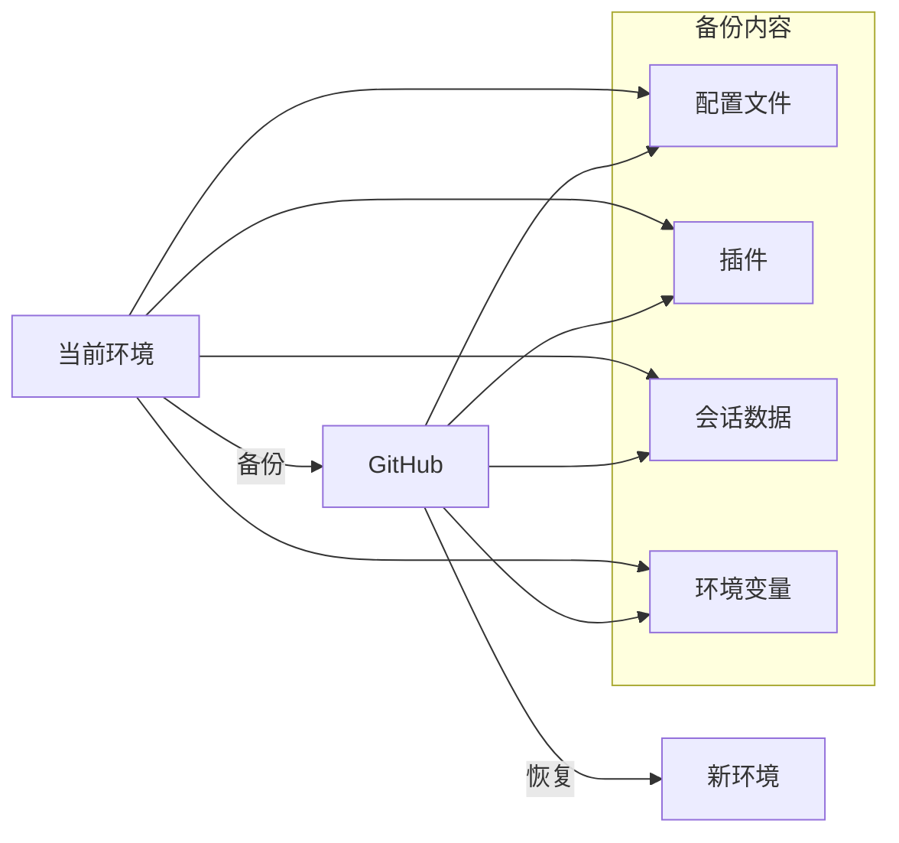
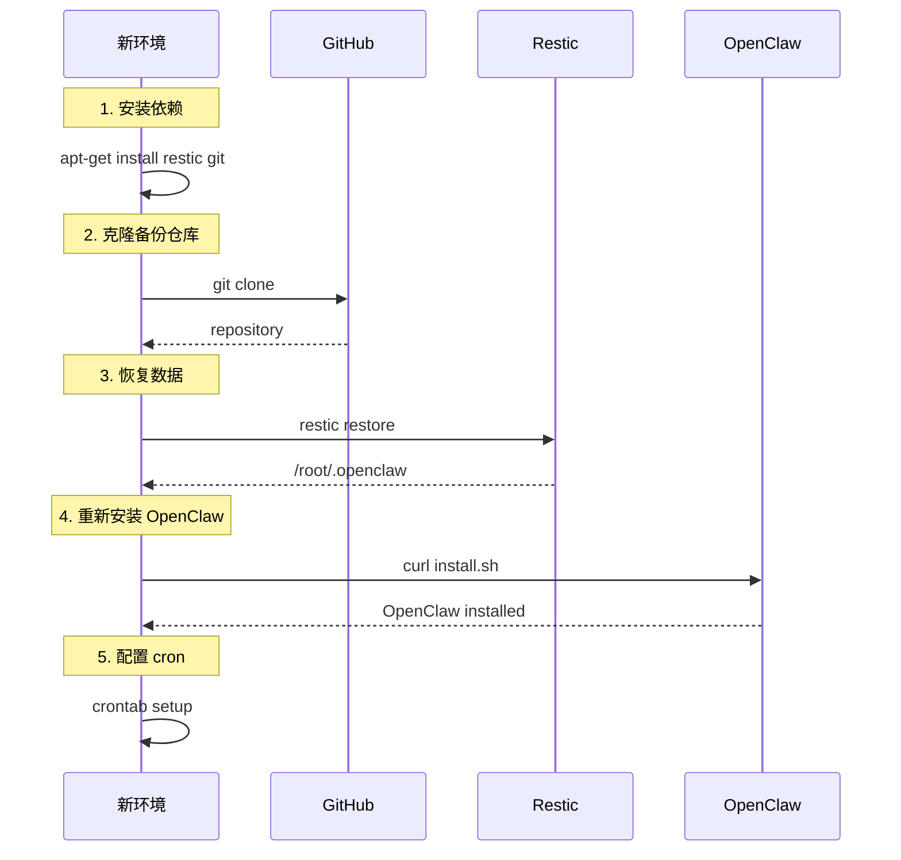
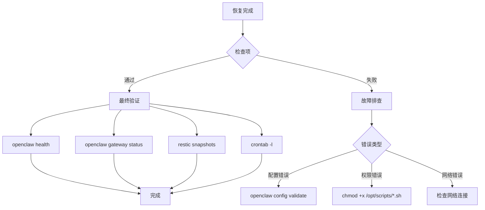

# OpenClaw 环境恢复指南

本文档说明如何在新的 monkeycode-ai 开发环境中，从 GitHub 恢复完整的 OpenClaw 配置、数据和插件。

## 场景说明



---

## 恢复流程概览



---

## 详细恢复步骤

### Step 1: 安装基础依赖

```bash
# 更新包列表
apt-get update

# 安装 restic (备份恢复工具)
apt-get install -y restic

# 安装 git (版本控制)
apt-get install -y git

# 验证安装
restic version
git --version
```

### Step 2: 克隆备份仓库

```bash
# 创建备份目录
mkdir -p /root/.openclaw-backups

# 克隆 GitHub 仓库
cd /root/.openclaw-backups
git clone https://github.com/savior-li/portable-openclaw.git .

# 验证仓库内容
ls -la
```

仓库结构应包含：
```
/root/.openclaw-backups/
├── restic/                    # restic 快照仓库
│   ├── config
│   ├── data/
│   ├── index/
│   ├── keys/
│   └── snapshots/
└── (其他备份文件)
```

### Step 3: 恢复 OpenClaw 数据

```bash
# 设置仓库密码
export RESTIC_PASSWORD="735d591f6831"

# 查看可用快照
restic snapshots --repo /root/.openclaw-backups/restic

# 恢复最新快照
restic restore latest \
    --repo /root/.openclaw-backups/restic \
    --target /

# 验证恢复
ls -la /root/.openclaw/
```

恢复后的目录结构：
```
/root/.openclaw/
├── openclaw.json              # 主配置文件
├── exec-approvals.json        # exec 权限配置
├── agents/                    # Agent 配置
│   └── main/
│       └── sessions/          # 会话数据
├── extensions/                # 插件
│   └── openclaw-weixin/       # 微信插件
└── logs/                      # 日志
```

### Step 4: 安装 OpenClaw

```bash
# 下载并运行安装脚本
curl -fsSL https://openclaw.ai/install.sh | bash

# 验证安装
openclaw --version
openclaw doctor
```

### Step 5: 恢复环境变量

```bash
# 添加环境变量到 /etc/environment
cat >> /etc/environment << 'EOF'
MCAI_LLM_API_KEY=a7369912-cf56-41ed-885e-7e2582a87c43
MCAI_LLM_BASE_URL=https://monkeycode-ai.com/v1
EOF

# 使环境变量生效
source /etc/environment

# 验证
echo $MCAI_LLM_API_KEY
echo $MCAI_LLM_BASE_URL
```

### Step 6: 重新安装微信插件

```bash
# 重新安装微信插件
npx -y @tencent-weixin/openclaw-weixin-cli@latest install
```

### Step 7: 验证配置

```bash
# 验证配置文件
openclaw config validate

# 检查 Gateway 状态
openclaw gateway status

# 运行健康检查
openclaw doctor
```

### Step 8: 配置 Cron 定时任务

```bash
# 创建备份脚本
mkdir -p /opt/scripts
cat > /opt/scripts/backup-openclaw.sh << 'SCRIPT'
#!/bin/bash
export RESTIC_PASSWORD="735d591f6831"
restic backup /root/.openclaw \
    --repo /root/.openclaw-backups/restic \
    --tag "openclaw-auto-backup" \
    --host "$(hostname)"
restic forget --repo /root/.openclaw-backups/restic \
    --tag "openclaw-auto-backup" \
    --keep-last 30 --prune
cd /root/.openclaw-backups
git add .
git commit -m "Backup $(date)" 2>/dev/null || true
git push 2>/dev/null || echo "Push skipped"
SCRIPT

chmod +x /opt/scripts/backup-openclaw.sh

# 添加 cron 任务 (每10分钟)
(crontab -l 2>/dev/null; echo "*/10 * * * * /opt/scripts/backup-openclaw.sh >> /var/log/openclaw-backup.log 2>&1") | crontab -

# 验证 cron
crontab -l
```

---

## 恢复检查清单



### 检查清单

| 检查项 | 命令 | 预期结果 |
|--------|------|---------|
| OpenClaw 版本 | `openclaw --version` | `2026.4.1` |
| 配置文件 | `cat /root/.openclaw/openclaw.json` | 存在且有效 |
| Gateway 状态 | `openclaw gateway status` | `RPC probe: ok` |
| 健康检查 | `openclaw health` | 返回健康状态 |
| Provider 配置 | `openclaw config get models` | 显示 monkeycode-ai |
| exec 权限 | `cat /root/.openclaw/exec-approvals.json` | 含 `**` pattern |
| 微信插件 | `ls /root/.openclaw/extensions/` | 含 openclaw-weixin |
| 备份快照 | `restic snapshots --repo /root/.openclaw-backups/restic` | 显示快照列表 |
| Cron 任务 | `crontab -l` | 含 backup-openclaw.sh |

---

## 故障排查

### 问题 1: restic 仓库密码错误

```
Fatal: could not decrypt snapshot: wrong password
```

**解决**:
```bash
# 确认密码正确
export RESTIC_PASSWORD="735d591f6831"

# 如果密码不记得，需要从最新快照重新设置
# 警告：这将丢失旧的加密数据
```

### 问题 2: 快照不存在

```
 Fatal: repository contains no snapshots
```

**解决**:
```bash
# 检查 git 仓库是否有数据
cd /root/.openclaw-backups
git log --oneline

# 如果仓库为空，需要重新初始化
export RESTIC_PASSWORD="735d591f6831"
restic init --repo /root/.openclaw-backups/restic
```

### 问题 3: Gateway 启动失败

```
Gateway service disabled
```

**解决**:
```bash
# 手动启动
openclaw gateway &

# 检查配置文件
openclaw config validate
```

### 问题 4: 插件加载失败

```
plugins.allow is empty
```

**解决**:
```bash
# 编辑配置添加信任的插件
cat > /root/.openclaw/openclaw.json << 'EOF'
{
  "plugins": {
    "allow": ["openclaw-weixin"]
  }
}
EOF

# 重新安装插件
npx -y @tencent-weixin/openclaw-weixin-cli@latest install
```

### 问题 5: API 调用失败

```
 MCAI_LLM_API_KEY not found
```

**解决**:
```bash
# 检查环境变量
echo $MCAI_LLM_API_KEY

# 如果为空，重新设置
export MCAI_LLM_API_KEY="a7369912-cf56-41ed-885e-7e2582a87c43"
cat >> /etc/environment << 'EOF'
MCAI_LLM_API_KEY=a7369912-cf56-41ed-885e-7e2582a87c43
EOF
```

---

## 一键恢复脚本

将以下内容保存为 `restore-openclaw.sh` 并执行：

```bash
#!/bin/bash
set -e

echo "=========================================="
echo " OpenClaw 环境恢复脚本"
echo "=========================================="

# 1. 安装依赖
echo "[1/8] 安装依赖..."
apt-get update -qq
apt-get install -y -qq restic git > /dev/null 2>&1
echo " 依赖安装完成"

# 2. 克隆备份
echo "[2/8] 克隆备份仓库..."
mkdir -p /root/.openclaw-backups
cd /root/.openclaw-backups
git clone https://github.com/savior-li/portable-openclaw.git . 2>/dev/null || git pull
echo " 备份仓库已克隆"

# 3. 恢复数据
echo "[3/8] 恢复 OpenClaw 数据..."
export RESTIC_PASSWORD="735d591f6831"
restic restore latest --repo /root/.openclaw-backups/restic --target / 2>/dev/null || echo " 跳过恢复"
echo " 数据恢复完成"

# 4. 安装 OpenClaw
echo "[4/8] 安装 OpenClaw..."
if ! command -v openclaw &> /dev/null; then
    curl -fsSL https://openclaw.ai/install.sh | bash > /dev/null 2>&1
fi
echo " OpenClaw 已安装: $(openclaw --version)"

# 5. 恢复环境变量
echo "[5/8] 恢复环境变量..."
cat >> /etc/environment << 'EOF'
MCAI_LLM_API_KEY=a7369912-cf56-41ed-885e-7e2582a87c43
MCAI_LLM_BASE_URL=https://monkeycode-ai.com/v1
EOF
source /etc/environment
echo " 环境变量已设置"

# 6. 重新安装微信插件
echo "[6/8] 重新安装微信插件..."
npx -y @tencent-weixin/openclaw-weixin-cli@latest install > /dev/null 2>&1 || echo " 插件安装跳过"
echo " 微信插件已安装"

# 7. 配置 Cron
echo "[7/8] 配置定时备份..."
mkdir -p /opt/scripts
cat > /opt/scripts/backup-openclaw.sh << 'SCRIPT'
#!/bin/bash
export RESTIC_PASSWORD="735d591f6831"
restic backup /root/.openclaw --repo /root/.openclaw-backups/restic --tag "openclaw-auto-backup" --host "$(hostname)"
restic forget --repo /root/.openclaw-backups/restic --tag "openclaw-auto-backup" --keep-last 30 --prune
cd /root/.openclaw-backups
git add . && git commit -m "Backup $(date)" 2>/dev/null && git push 2>/dev/null || true
SCRIPT
chmod +x /opt/scripts/backup-openclaw.sh
(crontab -l 2>/dev/null; echo "*/10 * * * * /opt/scripts/backup-openclaw.sh >> /var/log/openclaw-backup.log 2>&1") | crontab -
echo " 定时备份已配置"

# 8. 验证
echo "[8/8] 验证安装..."
openclaw health > /dev/null 2>&1 && echo " 健康检查通过" || echo " 健康检查失败"

echo "=========================================="
echo " 恢复完成！"
echo "=========================================="
echo " Gateway: http://127.0.0.1:18789"
echo " 备份目录: /root/.openclaw-backups"
echo " 备份脚本: /opt/scripts/backup-openclaw.sh"
```

**使用方法**:
```bash
chmod +x restore-openclaw.sh
./restore-openclaw.sh
```

---

## 数据说明

### 备份包含的数据

| 数据类型 | 路径 | 说明 |
|----------|------|------|
| 主配置 | `/root/.openclaw/openclaw.json` | Gateway、Provider、CORS 配置 |
| exec 权限 | `/root/.openclaw/exec-approvals.json` | `**` 权限配置 |
| Agent 配置 | `/root/.openclaw/agents/` | Agent 级别配置 |
| 会话数据 | `/root/.openclaw/agents/main/sessions/` | 对话历史 |
| 插件 | `/root/.openclaw/extensions/` | 微信插件等 |
| 日志 | `/root/.openclaw/logs/` | 运行日志 |

### 未备份的数据

| 数据类型 | 说明 | 恢复方式 |
|----------|------|---------|
| 环境变量 | 已在文档中说明 | 手动恢复 |
| Cron 任务 | 脚本中包含 | 重新配置 |
| rclone 配置 | 如使用 | 手动恢复 |
| systemd 服务 | 如配置 | 手动恢复 |

---

## 相关链接

| 资源 | 链接 |
|------|------|
| OpenClaw 文档 | https://docs.openclaw.ai/install |
| Restic 文档 | https://restic.readthedocs.io/ |
| 备份仓库 | https://github.com/savior-li/portable-openclaw |
| monkeycode-ai | https://monkeycode-ai.com/ |
