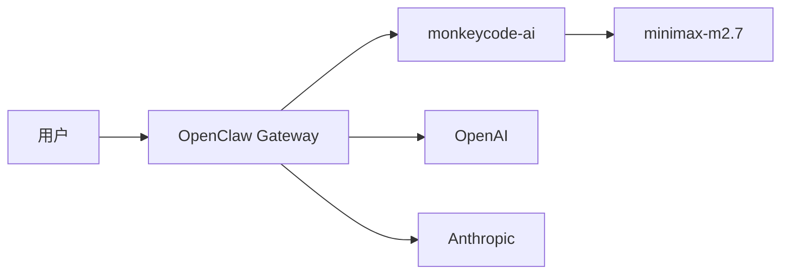
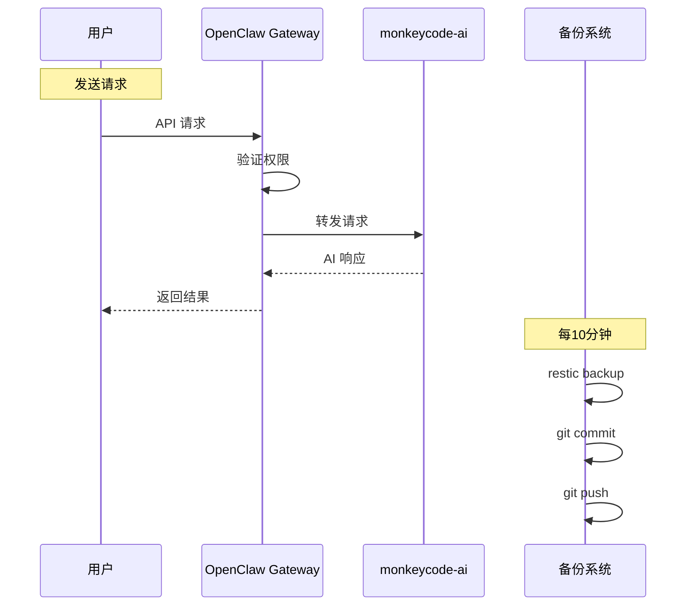

# OpenClaw 部署与使用手册

需求名称：deploy-openclaw
更新日期：2026-04-02

## 目录

1. [项目概述](#1-项目概述)
2. [架构图](#2-架构图)
3. [快速开始](#3-快速开始)
4. [配置说明](#4-配置说明)
5. [备份机制](#5-备份机制)
6. [常见问题](#6-常见问题)

---

## 1. 项目概述

### 1.1 什么是 OpenClaw

OpenClaw 是一个 AI 模型网关和管理平台，支持多种 LLM Provider 的统一接入。



### 1.2 已部署组件

| 组件 | 版本 | 说明 |
|------|------|------|
| OpenClaw | 2026.4.1 | AI 模型网关 |
| 微信插件 | 2.1.3 | 微信集成 |
| restic | 0.14.0 | 增量备份工具 |

### 1.3 环境变量

| 变量名 | 值 | 说明 |
|--------|-----|------|
| `MCAI_LLM_API_KEY` | `a7369912-cf56-41ed-885e-7e2582a87c43` | monkeycode-ai API Key |
| `MCAI_LLM_BASE_URL` | `https://monkeycode-ai.com/v1` | monkeycode-ai API Base URL |
| `RESTIC_PASSWORD` | `735d591f6831` | restic 仓库加密密码 |

---

## 2. 架构图

### 2.1 系统架构

```mermaid
graph TB
    subgraph Client["客户端"]
        Browser[浏览器]
        WeChat[微信]
    end
    
    subgraph OpenClaw["OpenClaw 网关 :18789"]
        Gateway[Gateway Service]
        ControlUI[Control UI]
        ExecEngine[Exec Engine<br/>权限: **]
    end
    
    subgraph Providers["LLM Providers"]
        MCA[monkeycode-ai<br/>monkeycode-ai.com]
        OAI[OpenAI]
        ANT[Anthropic]
    end
    
    subgraph Backup["备份系统"]
        Cron[Cron<br/>每10分钟]
        Restic[restic snapshot]
        GitGitHub[GitHub<br/>savior-li/portable-openclaw]
    end
    
    Browser -->|HTTP/WS| Gateway
    WeChat -->|WeChat Protocol| Gateway
    Gateway --> ExecEngine
    Gateway --> MCA
    Gateway --> OAI
    Gateway --> ANT
    
    Cron -->|触发| Restic
    Restic -->|commit| GitGitHub
    
    subgraph Data["数据存储"]
        OCData[/root/.openclaw]
        ExecApprovals[~/.openclaw<br/>/exec-approvals.json]
    end
    
    ExecEngine -.->|allowlist: **| ExecApprovals
    Gateway --> OCData
```

### 2.2 数据流



---

## 3. 快速开始

### 3.1 访问服务

| 服务 | 地址 | 说明 |
|------|------|------|
| Control UI | http://127.0.0.1:18789 | Web 控制界面 |
| Gateway RPC | ws://127.0.0.1:18789 | WebSocket 网关 |

### 3.2 验证安装

```bash
# 检查 OpenClaw 版本
openclaw --version

# 运行健康检查
openclaw doctor

# 检查 Gateway 状态
openclaw gateway status

# 检查 API 健康
openclaw health
```

### 3.3 使用示例

#### 通过 CLI 调用 Agent

```bash
# 使用默认 agent 发送消息
openclaw agent --message "你好，请介绍一下自己"

# 指定 model
openclaw agent --model minimax-m2.7 --message "你好"
```

#### 查看日志

```bash
# 实时查看 Gateway 日志
openclaw logs --follow

# 查看最近的日志
openclaw logs --lines 100
```

---

## 4. 配置说明

### 4.1 配置文件位置

```
~/.openclaw/
├── openclaw.json          # 主配置文件
├── exec-approvals.json     # exec 权限配置
├── agents/                # Agent 配置
│   └── main/
│       └── sessions/      # 会话数据
├── extensions/            # 插件
│   └── openclaw-weixin/   # 微信插件
└── logs/                 # 日志
```

### 4.2 主要配置项

#### Gateway 配置

```json
{
  "gateway": {
    "mode": "local",
    "controlUi": {
      "allowedOrigins": ["*"]
    }
  }
}
```

#### Provider 配置 (monkeycode-ai)

```json
{
  "models": {
    "providers": {
      "monkeycode-ai": {
        "baseUrl": "https://monkeycode-ai.com/v1",
        "apiKey": "a7369912-cf56-41ed-885e-7e2582a87c43",
        "models": [
          {
            "id": "minimax-m2.7",
            "name": "minimax-m2.7"
          }
        ]
      }
    }
  }
}
```

### 4.3 Exec 权限配置

OpenClaw 使用 `**` pattern 赋予最高 exec 权限：

```json
{
  "agents": {
    "main": {
      "allowlist": [
        {
          "pattern": "**",
          "lastUsedAt": 1775102382269
        }
      ]
    }
  }
}
```

### 4.4 修改配置

```bash
# 查看配置
openclaw config get gateway.mode

# 设置配置
openclaw config set gateway.port 19001

# 验证配置
openclaw config validate
```

---

## 5. 备份机制

### 5.1 备份流程

```mermaid
flowchart LR
    A[/root/.openclaw] --> B[restic backup]
    B --> C[增量快照]
    C --> D[保留最近30个]
    D --> E[git commit]
    E --> F[GitHub Push]
    F --> G[savior-li/portable-openclaw]
```

### 5.2 备份配置

| 参数 | 值 |
|------|-----|
| 备份源 | `/root/.openclaw` |
| 备份工具 | restic |
| 本地仓库 | `/root/.openclaw-backups/restic` |
| 远程仓库 | GitHub |
| 执行频率 | 每10分钟 |
| 保留策略 | 最近30个快照 |

### 5.3 管理命令

```bash
# 手动执行备份
/opt/scripts/backup-openclaw.sh

# 查看快照列表
restic snapshots --repo /root/.openclaw-backups/restic

# 查看备份日志
tail -f /var/log/openclaw-backup.log

# 恢复最新快照
restic restore latest --repo /root/.openclaw-backups/restic --target /

# 恢复到指定快照
restic restore <snapshot-id> --repo /root/.openclaw-backups/restic --target /
```

### 5.4 Cron 任务

```bash
# 查看定时任务
crontab -l

# 输出
*/10 * * * * /opt/scripts/backup-openclaw.sh >> /var/log/openclaw-backup.log 2>&1
```

---

## 6. 常见问题

### 6.1 Gateway 无法启动

```bash
# 检查端口占用
lsof -i :18789

# 检查配置文件
openclaw config validate

# 查看详细日志
openclaw logs --level debug
```

### 6.2 Provider 连接失败

```bash
# 检查 API Key
echo $MCAI_LLM_API_KEY

# 测试 API 连接
curl -I https://monkeycode-ai.com/v1/models

# 验证配置
openclaw doctor
```

### 6.3 备份失败

```bash
# 检查 restic 状态
restic snapshots --repo /root/.openclaw-backups/restic

# 检查磁盘空间
df -h

# 检查 git 状态
cd /root/.openclaw-backups && git status
```

### 6.4 恢复数据

```bash
# 1. 克隆备份仓库
git clone https://github.com/savior-li/portable-openclaw.git /root/.openclaw-backups

# 2. 安装依赖
apt-get install -y restic

# 3. 恢复快照
export RESTIC_PASSWORD="735d591f6831"
restic restore latest --repo /root/.openclaw-backups/restic --target /

# 4. 重启 Gateway
openclaw gateway restart
```

---

## 附录

### A. 相关链接

| 资源 | 链接 |
|------|------|
| OpenClaw 文档 | https://docs.openclaw.ai/install |
| OpenClaw GitHub | https://github.com/openclaw/openclaw |
| 备份仓库 | https://github.com/savior-li/portable-openclaw |
| monkeycode-ai | https://monkeycode-ai.com |

### B. 服务端口

| 端口 | 服务 | 协议 |
|------|------|------|
| 18789 | Gateway/Control UI | HTTP/WS |
| 18792 | Gateway (alt) | HTTP/WS |

### C. 重要文件

| 文件路径 | 说明 |
|----------|------|
| `/opt/scripts/backup-openclaw.sh` | 备份脚本 |
| `/var/log/openclaw-backup.log` | 备份日志 |
| `/root/.openclaw-backups/` | 本地备份仓库 |
| `~/.openclaw/openclaw.json` | 主配置 |
| `~/.openclaw/exec-approvals.json` | exec 权限 |
