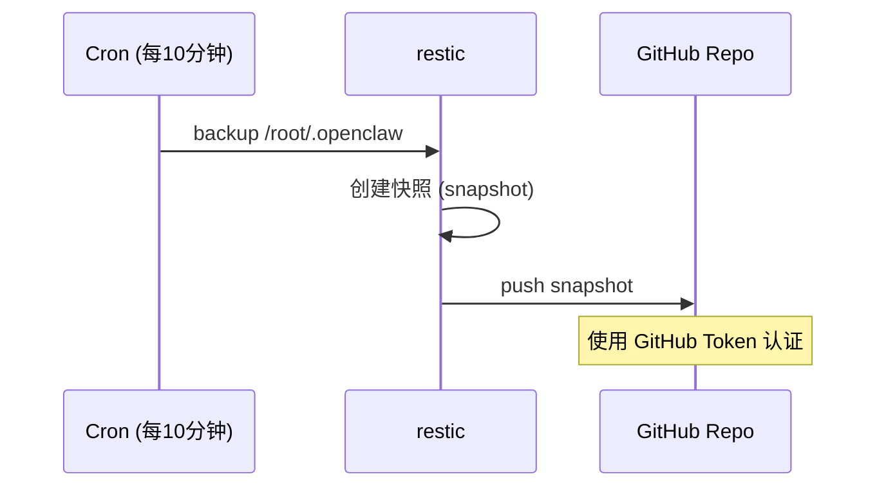

# OpenClaw 部署技术方案

需求名称：deploy-openclaw
更新日期：2026-04-02

## 描述

在 monkeycode-ai 开发环境中部署 OpenClaw，配置 monkeycode-ai provider 和 minimax-m2.7 model，实现数据持久化和跨域访问。

## 概述

OpenClaw 是一个 AI 模型网关和管理平台，支持多种 LLM Provider 的统一接入。本方案旨在开发环境中部署 OpenClaw，实现：

- OpenClaw 核心服务部署
- monkeycode-ai Provider 和 minimax-m2.7 Model 配置
- CORS 跨域访问配置
- 微信插件集成
- 数据自动备份与快照机制 (restic + GitHub)

## 架构

```mermaid
graph TB
    subgraph OpenClaw["OpenClaw 环境"]
        OC[OpenClaw Gateway<br/>:18792]
        OCUI[Control UI<br/>:18789]
        OCData[/root/.openclaw]
    end
    
    subgraph Providers["Provider 配置"]
        MCA[monkeycode-ai Provider]
        M27[minimax-m2.7 Model]
    end
    
    subgraph Backup["备份机制 (每10分钟)"]
        Cron[Cron Job]
        Restic[restic snapshot]
        GitHub[GitHub Repo<br/>savior-li/portable-openclaw]
    end
    
    OC <--> MCA
    MCA --> M27
    OCUI -->|CORS *| Browser
    
    Cron -->|backup| Restic
    Restic -->|push| GitHub

    subgraph Env["环境变量"]
        API_KEY[MCAI_LLM_API_KEY]
        BASE_URL[ MCAI_LLM_BASE_URL]
    end
    
    MCA -.->|引用| API_KEY
    MCA -.->|引用| BASE_URL
```

## 环境变量

| 变量名 | 值 | 说明 |
|--------|-----|------|
| `MCAI_LLM_API_KEY` | `a7369912-cf56-41ed-885e-7e2582a87c43` | monkeycode-ai API Key |
| `MCAI_LLM_BASE_URL` | `https://monkeycode-ai.com/v1` | monkeycode-ai API Base URL |

## 组件与接口

### 1. OpenClaw Core

| 组件 | 说明 | 默认端口 |
|------|------|---------|
| Gateway | OpenClaw 网关服务 | 18792 |
| Control UI | Web 控制界面 | 18789 |

### 2. Provider 配置

```yaml
# /root/.openclaw/config.yaml
providers:
  monkeycode-ai:
    type: openai-compatible
    baseURL: ${MCAI_LLM_BASE_URL}
    apiKey: ${MCAI_LLM_API_KEY}
    models:
      - id: minimax-m2.7
        name: minimax-m2.7
        capabilities:
          - chat
          - completion
```

### 3. CORS 配置

Control UI 允许所有来源跨域访问：

```yaml
# /root/.openclaw/config.yaml
server:
  controlUi:
    cors:
      allowedOrigins:
        - "*"
      allowedMethods:
        - GET
        - POST
        - PUT
        - DELETE
        - OPTIONS
      allowedHeaders:
        - "*"
```

### 4. 微信插件

```bash
npx -y @tencent-weixin/openclaw-weixin-cli@latest install
```

## 数据模型

### OpenClaw 数据目录结构

```
/root/.openclaw/
├── config.yaml          # 主配置文件
├── data/
│   ├── providers.json    # Provider 状态
│   ├── models.json       # Model 配置
│   └── conversations.db  # 对话数据 (SQLite)
├── logs/
│   └── gateway.log      # 网关日志
└── cache/                # 缓存目录
```

### 备份目标

使用 restic 备份 `/root/.openclaw` 目录到 GitHub 仓库。

## 备份机制

### 工具选择

| 工具 | 用途 |
|------|------|
| restic | 增量快照备份 |
| GitHub | 远程存储仓库 |

### 备份配置

| 参数 | 值 |
|------|-----|
| GitHub 仓库 | `github:savior-li/portable-openclaw` |
| 加密密码 | `735d591f6831` |
| 备份源目录 | `/root/.openclaw` |
| 快照标签 | `openclaw-auto-backup` |
| 保留策略 | 最近 30 个快照 |

### Restic + GitHub 备份流程



### 备份脚本

```bash
#!/bin/bash
# /opt/scripts/backup-openclaw.sh

export MCAI_LLM_API_KEY="a7369912-cf56-41ed-885e-7e2582a87c43"
export MCAI_LLM_BASE_URL="https://monkeycode-ai.com/v1"

export RESTIC_REPOSITORY="github:savior-li/portable-openclaw"
export RESTIC_PASSWORD="735d591f6831"
BACKUP_SOURCE="/root/.openclaw"
TAG="openclaw-auto-backup"

restic backup "$BACKUP_SOURCE" \
    --repo "$RESTIC_REPOSITORY" \
    --tag "$TAG" \
    --host "$(hostname)"

restic forget --repo "$RESTIC_REPOSITORY" \
    --tag "$TAG" \
    --keep-last 30 \
    --prune
```

### Cron 配置

```cron
# 每10分钟执行一次备份
*/10 * * * * /opt/scripts/backup-openclaw.sh >> /var/log/openclaw-backup.log 2>&1
```

### 快照管理命令

```bash
# 列出所有快照
restic snapshots --repo "github:savior-li/portable-openclaw"

# 恢复最新快照到 /root/.openclaw
restic restore latest --repo "github:savior-li/portable-openclaw" --target /root/.openclaw --match-interpreter "host=$(hostname)"

# 恢复到指定快照
restic restore <snapshot-id> --repo "github:savior-li/portable-openclaw" --target /root/.openclaw

# 手动触发备份
/opt/scripts/backup-openclaw.sh
```

## 实施步骤

### Phase 1: 安装 OpenClaw

```bash
# 检测并安装 Node 24
curl -fsSL https://openclaw.ai/install.sh | bash

# 验证安装
openclaw --version
openclaw doctor
```

### Phase 2: 配置环境变量

```bash
# 在 /etc/environment 中添加持久化环境变量
cat >> /etc/environment << 'EOF'
MCAI_LLM_API_KEY=a7369912-cf56-41ed-885e-7e2582a87c43
MCAI_LLM_BASE_URL=https://monkeycode-ai.com/v1
EOF

# 加载环境变量
export MCAI_LLM_API_KEY="a7369912-cf56-41ed-885e-7e2582a87c43"
export MCAI_LLM_BASE_URL="https://monkeycode-ai.com/v1"
```

### Phase 3: 配置 Provider 和 CORS

```bash
# 创建配置目录
mkdir -p /root/.openclaw

# 创建 /root/.openclaw/config.yaml
cat > /root/.openclaw/config.yaml << 'EOF'
providers:
  monkeycode-ai:
    type: openai-compatible
    baseURL: ${MCAI_LLM_BASE_URL}
    apiKey: ${MCAI_LLM_API_KEY}
    models:
      - id: minimax-m2.7
        name: minimax-m2.7
        capabilities:
          - chat
          - completion

server:
  controlUi:
    cors:
      allowedOrigins:
        - "*"
      allowedMethods:
        - GET
        - POST
        - PUT
        - DELETE
        - OPTIONS
      allowedHeaders:
        - "*"
EOF
```

### Phase 4: 微信插件

```bash
npx -y @tencent-weixin/openclaw-weixin-cli@latest install
```

### Phase 5: 安装 Restic

```bash
# 通过 apt 安装
apt-get update && apt-get install -y restic

# 或通过 npm 安装
npm install -g restic

# 验证安装
restic version
```

### Phase 6: 初始化 Restic 仓库

```bash
export RESTIC_REPOSITORY="github:savior-li/portable-openclaw"
export RESTIC_PASSWORD="735d591f6831"

# 初始化仓库 (首次运行时)
restic init --repo "$RESTIC_REPOSITORY"

# 验证仓库访问
restic snapshots --repo "$RESTIC_REPOSITORY"
```

### Phase 7: 部署备份脚本

```bash
# 创建脚本目录
mkdir -p /opt/scripts

# 创建备份脚本
cat > /opt/scripts/backup-openclaw.sh << 'EOF'
#!/bin/bash

export MCAI_LLM_API_KEY="a7369912-cf56-41ed-885e-7e2582a87c43"
export MCAI_LLM_BASE_URL="https://monkeycode-ai.com/v1"
export RESTIC_REPOSITORY="github:savior-li/portable-openclaw"
export RESTIC_PASSWORD="735d591f6831"

BACKUP_SOURCE="/root/.openclaw"
TAG="openclaw-auto-backup"

restic backup "$BACKUP_SOURCE" \
    --repo "$RESTIC_REPOSITORY" \
    --tag "$TAG" \
    --host "$(hostname)"

restic forget --repo "$RESTIC_REPOSITORY" \
    --tag "$TAG" \
    --keep-last 30 \
    --prune
EOF

chmod +x /opt/scripts/backup-openclaw.sh
```

### Phase 8: 配置 Cron

```bash
# 添加 cron 任务
(crontab -l 2>/dev/null; echo "*/10 * * * * /opt/scripts/backup-openclaw.sh >> /var/log/openclaw-backup.log 2>&1") | crontab -

# 验证 crontab
crontab -l
```

## 正确性属性

1. **数据完整性**: Restic 使用 AES-256 加密，确保备份数据安全
2. **增量备份**: 仅备份变更内容，减少存储和网络开销
3. **可恢复性**: 可恢复到任意时间点的快照
4. **自动化**: 全自动执行，无需人工干预
5. **跨环境**: 快照存储在 GitHub，新环境可快速恢复

## 错误处理

| 场景 | 处理方式 |
|------|---------|
| 网络中断 | Cron 下次执行时自动重试 |
| GitHub 认证失败 | 记录日志，告警通知 |
| 磁盘空间不足 | 清理旧快照后重试 |
| Restic 仓库损坏 | 从 GitHub 拉取最新快照恢复 |

## 测试策略

| 测试项 | 验证方法 |
|--------|---------|
| 安装测试 | `openclaw doctor` 验证安装状态 |
| Provider 测试 | 启动 Gateway，调用 API 验证 Provider 连接 |
| CORS 测试 | `curl -I -H "Origin: *" http://localhost:18789` 验证跨域头 |
| 备份测试 | 手动执行 `/opt/scripts/backup-openclaw.sh`，验证 GitHub 快照创建 |
| 恢复测试 | 从快照恢复，验证数据完整性 |

## 新环境恢复流程

当在新的开发环境中工作时，按以下步骤恢复数据：

```bash
# 1. 安装 OpenClaw
curl -fsSL https://openclaw.ai/install.sh | bash

# 2. 安装 restic
apt-get install -y restic

# 3. 恢复数据
export RESTIC_REPOSITORY="github:savior-li/portable-openclaw"
export RESTIC_PASSWORD="735d591f6831"
restic restore latest --repo "$RESTIC_REPOSITORY" --target /

# 4. 配置环境变量
export MCAI_LLM_API_KEY="a7369912-cf56-41ed-885e-7e2582a87c43"
export MCAI_LLM_BASE_URL="https://monkeycode-ai.com/v1"

# 5. 重新安装微信插件
npx -y @tencent-weixin/openclaw-weixin-cli@latest install

# 6. 验证恢复
openclaw doctor
```

## 引用链接

- [OpenClaw 官方文档](https://docs.openclaw.ai/install)
- [OpenClaw GitHub](https://github.com/openclaw/openclaw)
- [Restic 文档](https://restic.readthedocs.io/)
- [备份仓库](https://github.com/savior-li/portable-openclaw)
