# GitHub 入门指南

> 面向初学者，通俗易懂，配有 Mermaid 流程图

---

## 目录

1. [GitHub 是什么？](#1-github-是什么)
2. [核心概念](#2-核心概念)
3. [Git 基础操作](#3-git-基础操作)
4. [GitHub 常用功能](#4-github-常用功能)
5. [标准工作流程](#5-标准工作流程)
6. [分支管理策略](#6-分支管理策略)
7. [最佳实践](#7-最佳实践)
8. [常用命令速查表](#8-常用命令速查表)

---

## 1. GitHub 是什么？

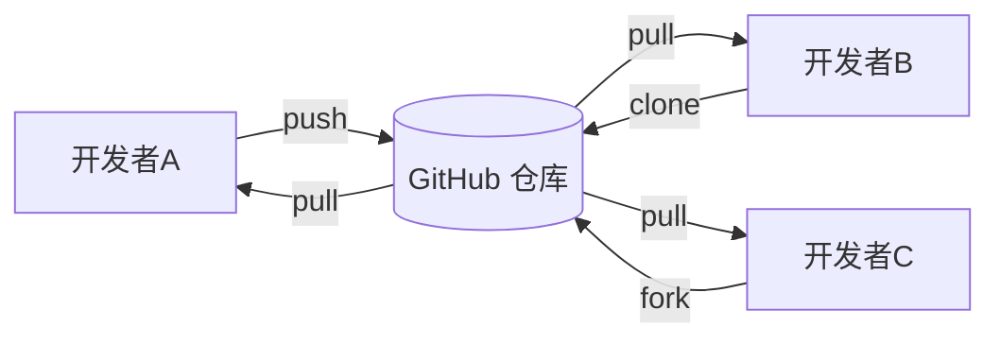

**一句话理解：**
GitHub 是一个基于 Git 的"代码云盘"，但比普通云盘强大得多——它能记录每一次修改、追踪谁改了什么、支持多人协作。

### GitHub 能做什么？

| 功能 | 说明 |
|------|------|
| 📦 **代码存储** | 把代码安全地保存在云端 |
| 🔄 **版本控制** | 任何修改都可以回溯 |
| 🤝 **多人协作** | 多人同时开发同一项目 |
| 🔍 **代码审查** | 在合并代码前进行审查 |
| 🐛 **Issue 追踪** | 管理任务、Bug、功能需求 |
| ⚙️ **自动化** | CI/CD 自动测试和部署 |

---

## 2. 核心概念

### 2.1 仓库 (Repository)

仓库就是存放项目的地方，类似于一个文件夹。

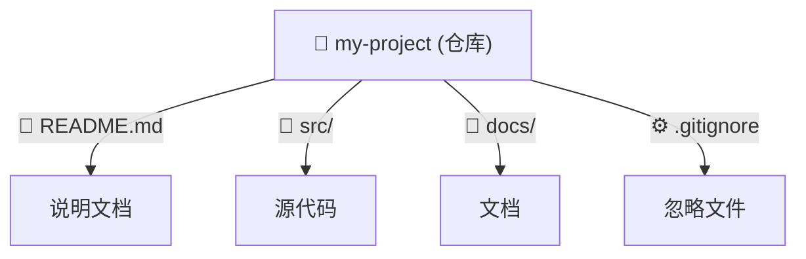

**两种仓库：**

- **Public（公开）**：任何人可见，免费
- **Private（私有）**：仅授权人员可见，通常需要付费

### 2.2 提交 (Commit)

每次"保存"称为一次提交，它会记录：
- 你做了什么修改
- 什么时候改的
- 是谁改的

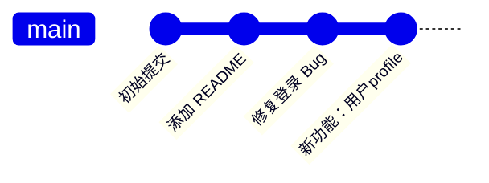

### 2.3 分支 (Branch)

分支是从主线上分出来的"副本"，让你可以在不影响主线的情况下开发新功能。

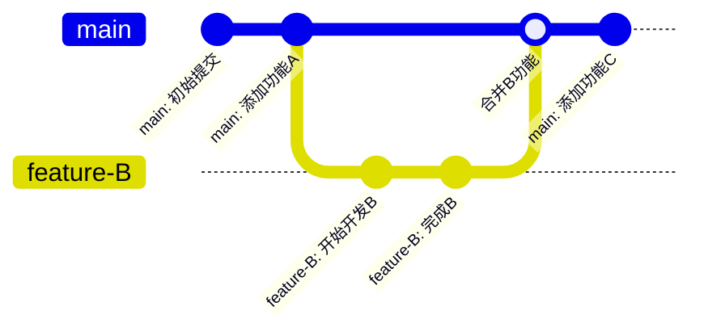

### 2.4 拉取请求 (Pull Request / PR)

当你完成开发，想把分支合并到主分支时，向仓库管理者发起"拉取请求"。

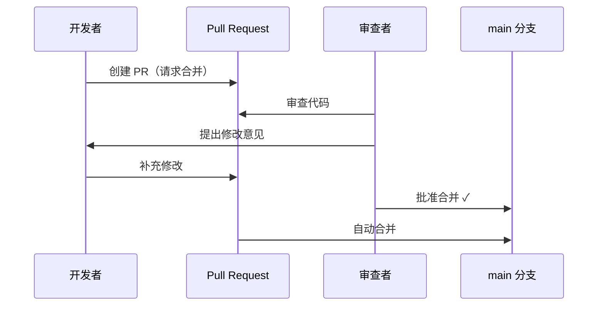

### 2.5 Issue

Issue 用于追踪任务、Bug、功能需求等。

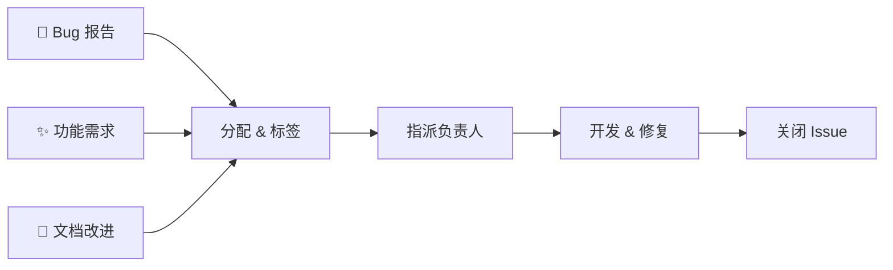

### 2.6 Fork（分叉）

Fork 是把别人的仓库复制一份到自己的账号下，方便自由修改而不影响原项目。

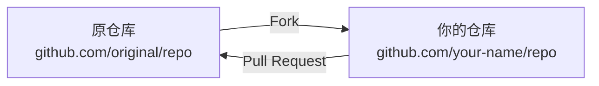

---

## 3. Git 基础操作

### 3.1 首次设置

```bash
# 配置用户名和邮箱
git config --global user.name "Your Name"
git config --global user.email "your@email.com"

# 查看配置
git config --list
```

### 3.2 创建仓库

```bash
# 在当前目录初始化
git init

# 克隆远程仓库
git clone https://github.com/username/repo-name.git
```

### 3.3 基本工作流

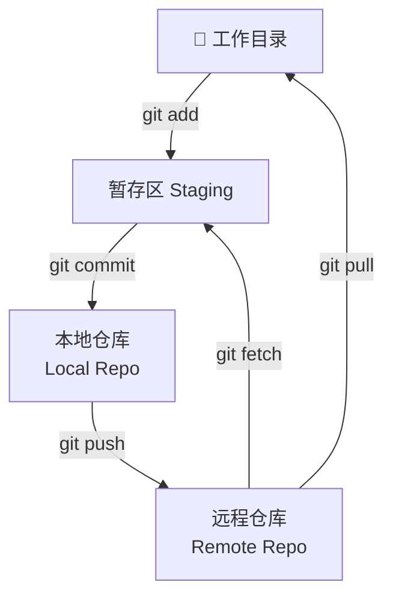

### 3.4 添加和提交

```bash
# 添加单个文件
git add filename.txt

# 添加所有修改
git add .

# 提交（写清楚做了什么）
git commit -m "修复了用户登录失败的问题"
```

### 3.5 推送和拉取

```bash
# 推送到远程
git push origin main

# 拉取最新代码
git pull origin main

# 获取但不合并
git fetch origin
```

---

## 4. GitHub 常用功能

### 4.1 README.md

仓库的"门面"，展示项目介绍、安装方法、使用示例。

```markdown
# 我的项目

## 📖 介绍
这是一个很棒的项目...

## 🚀 快速开始
```bash
npm install my-project
```

## 📄 许可证
MIT
```

### 4.2 Issue 和标签

| 标签颜色 | 含义 | 示例 |
|---------|------|------|
| 🔴 bug | Bug 报告 | 登录页面崩溃 |
| 🟢 enhancement | 新功能 | 添加深色模式 |
| 🔵 documentation | 文档改进 | 补充 API 文档 |
| 🟡 help wanted | 需要帮助 | 招募贡献者 |

### 4.3 GitHub Actions（CI/CD）

自动化测试、构建和部署。

```yaml
# .github/workflows/test.yml
name: 测试

on:
  push:
    branches: [main]
  pull_request:
    branches: [main]

jobs:
  test:
    runs-on: ubuntu-latest
    steps:
      - uses: actions/checkout@v4
      - name: 运行测试
        run: npm test
```

### 4.4 Projects（项目管理）

类似 Trello 的看板功能，可视化管理任务。

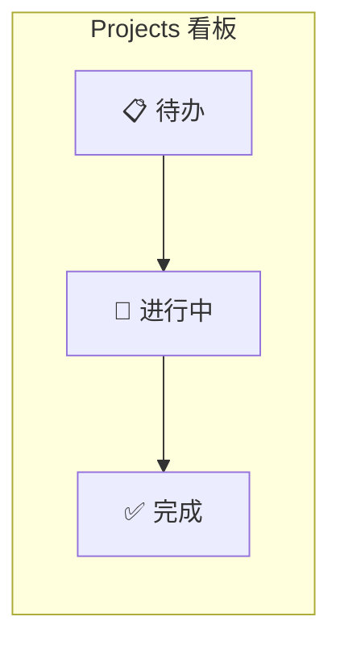

### 4.5 Wiki

项目文档中心，适合放更详细的技术文档。

---

## 5. 标准工作流程

### 5.1 协作开发流程（团队）

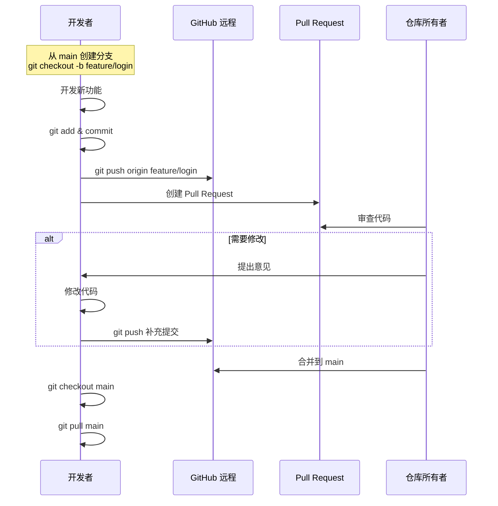

### 5.2 Fork 贡献流程（开源项目）

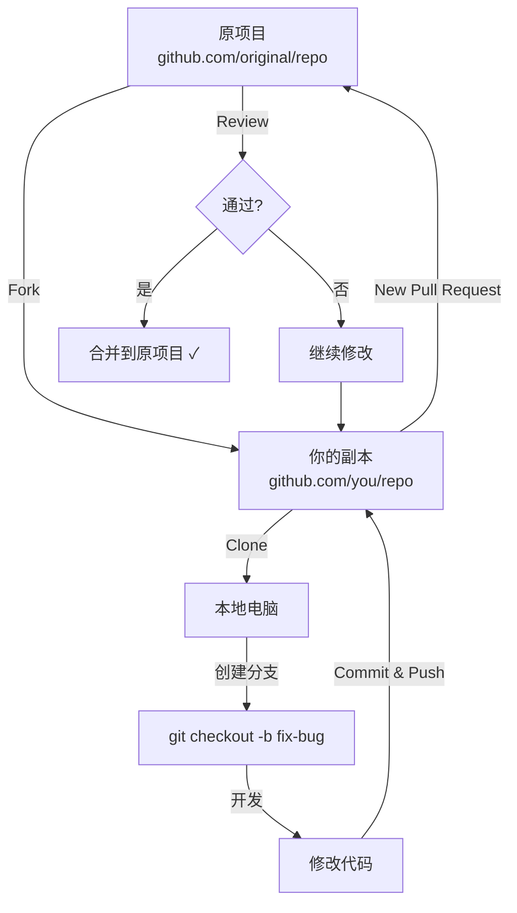

### 5.3 步骤详解

**第一步：从 main 创建功能分支**

```bash
git checkout main          # 切换到 main
git pull origin main      # 确保最新
git checkout -b feature/new-feature   # 创建并切换到新分支
```

**第二步：开发并提交**

```bash
git add .
git commit -m "feat: 添加新功能"
```

**第三步：推送并创建 PR**

```bash
git push origin feature/new-feature
```

然后在 GitHub 上：
1. 点击 **Compare & pull request**
2. 填写 PR 描述
3. 选择 Reviewer
4. 点击 **Create pull request**

**第四步：等待审查和合并**

---

## 6. 分支管理策略

### 6.1 GitFlow

适合有固定发布周期的大型项目。

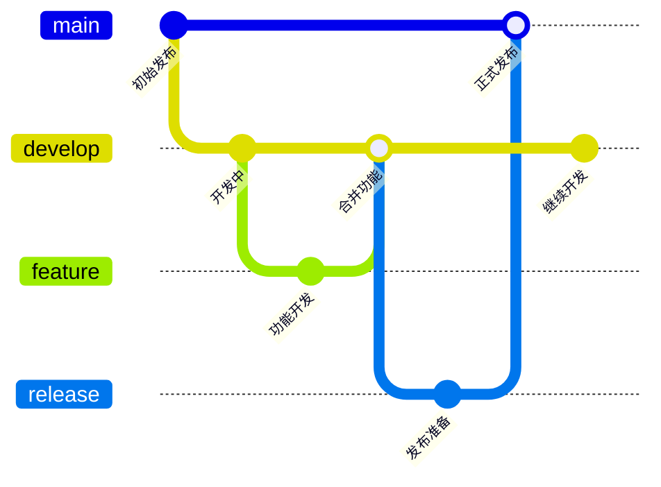

| 分支 | 用途 | 生命周期 |
|------|------|---------|
| main | 正式生产版本 | 永久 |
| develop | 开发主分支 | 永久 |
| feature/* | 新功能开发 | 用完即删 |
| release/* | 发布准备 | 用完即删 |
| hotfix/* | 紧急修复 | 用完即删 |

### 6.2 GitHub Flow

适合持续部署的敏捷团队。

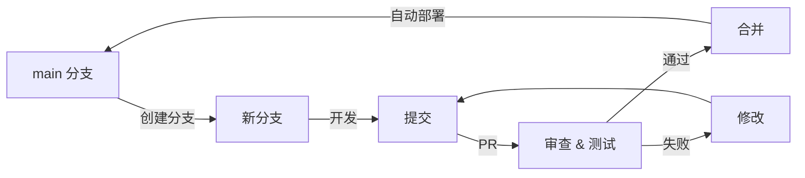

**规则：**
- ✅ 任何分支都可以合并到 main
- ✅ 合并后立即部署
- ✅ 分支应尽快合并，保持简洁

### 6.3 如何选择？

| 场景 | 推荐策略 |
|------|---------|
| 小团队 / 敏捷开发 | GitHub Flow |
| 大型项目 / 多版本 | GitFlow |
| 个人项目 | 简单分支即可 |
| 开源项目 | Fork + PR |

---

## 7. 最佳实践

### 7.1 提交信息规范

```bash
# 格式：类型: 简短描述
# 推荐类型：
#   feat:     新功能
#   fix:      修复 Bug
#   docs:     文档更新
#   style:    格式调整（不影响代码）
#   refactor: 重构
#   test:     测试相关
#   chore:    构建/工具相关
```

**好例子 ✅**

```bash
git commit -m "feat: 添加用户注册功能"
git commit -m "fix: 修复登录页面闪烁问题"
git commit -m "docs: 更新 API 文档"
```

**坏例子 ❌**

```bash
git commit -m "更新"
git commit -m "修改了代码"
git commit -m "asdfgh"
```

### 7.2 README 编写建议

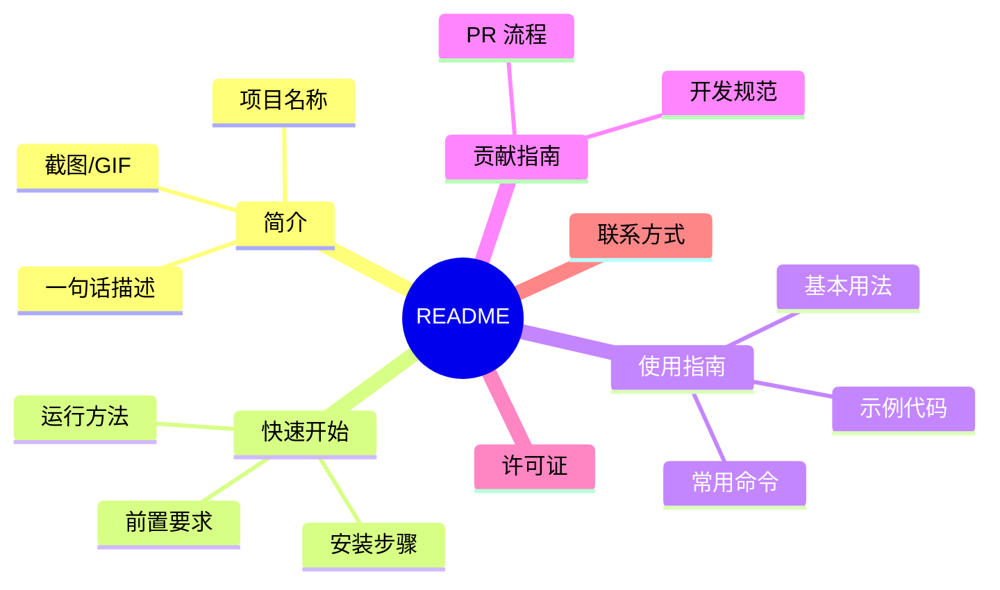

### 7.3 安全最佳实践

| 做法 | 说明 |
|------|------|
| 🔐 **启用 2FA** | 双因素身份验证 |
| 🚫 **不提交敏感信息** | 使用环境变量或 `.gitignore` |
| ✅ **代码审查** | 所有 PR 都需要审查 |
| 🔑 **使用 Deploy Key** | 机器人的最小权限原则 |
| 📋 **定期更新依赖** | 防止安全漏洞 |

### 7.4 .gitignore 示例

```gitignore
# 依赖
node_modules/
package-lock.json

# 构建产物
dist/
build/

# 环境变量
.env
.env.local

# IDE
.vscode/
.idea/

# 系统文件
.DS_Store
Thumbs.db

# 日志
*.log
npm-debug.log*

# 测试覆盖率
coverage/
```

### 7.5 协作建议

1. **频繁小提交** ✅
   ```bash
   # 好：每次完成一个小功能就提交
   git commit -m "feat: 添加搜索框"
   git commit -m "feat: 实现搜索逻辑"
   ```

2. **保持分支简洁** ✅
   - 一个分支只做一件事
   - 完成后尽快合并和删除

3. **写清楚 PR 描述** ✅
   ```markdown
   ## 做了什么
   - 添加了用户注册页面
   - 实现了邮箱验证功能
   
   ## 测试方法
   1. 打开 /register
   2. 输入邮箱和密码
   3. 点击注册按钮
   
   ## 截图
   
   ```

4. **代码审查心态** ✅
   - 审查者：提出建设性意见，不是批评
   - 作者：有则改之，无则解释

---

## 8. 常用命令速查表

### 8.1 基础命令

| 命令 | 说明 |
|------|------|
| `git init` | 初始化仓库 |
| `git clone url` | 克隆仓库 |
| `git status` | 查看状态 |
| `git add .` | 添加所有修改 |
| `git commit -m "信息"` | 提交 |
| `git push` | 推送到远程 |
| `git pull` | 拉取并合并 |
| `git fetch` | 仅获取 |

### 8.2 分支命令

| 命令 | 说明 |
|------|------|
| `git branch` | 查看分支 |
| `git branch name` | 创建分支 |
| `git checkout name` | 切换分支 |
| `git checkout -b name` | 创建并切换 |
| `git merge name` | 合并分支 |
| `git branch -d name` | 删除分支 |

### 8.3 查看历史

| 命令 | 说明 |
|------|------|
| `git log` | 查看提交历史 |
| `git log --oneline` | 简洁历史 |
| `git diff` | 查看未提交的修改 |
| `git diff --staged` | 查看暂存区修改 |

### 8.4 撤销操作

| 命令 | 说明 |
|------|------|
| `git checkout -- file` | 放弃文件修改 |
| `git reset HEAD file` | 取消暂存 |
| `git reset --soft HEAD~1` | 撤销上次提交（保留修改）|
| `git revert HEAD` | 创建新提交来撤销 |

---

## 常见问题

### Q: Git 和 GitHub 有什么区别？

```
Git    = 一款软件（版本控制工具），本地运行
GitHub = 一个网站（代码托管平台），云端运行
        类似 "Photo" vs "Instagram" 的关系
```

### Q: 冲突 (Conflict) 怎么办？

当两个人修改了同一文件的同一行时，会产生冲突。

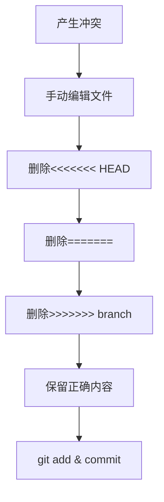

解决步骤：
```bash
# 1. 编辑冲突文件
# 2. 保留想要的内容，删除冲突标记
# 3. 提交
git add conflict-file.txt
git commit -m "解决冲突"
```

### Q: 如何回退到之前的版本？

```bash
# 查看历史，找到 commit ID
git log --oneline

# 回退（危险：会丢失修改）
git reset --hard 提交ID

# 安全回退：创建新提交
git revert 提交ID
```

---

## 下一步学习

1. **GitHub CLI** - 命令行管理 GitHub
2. **GitHub Actions** - 学习 CI/CD 自动化
3. **GitHub Pages** - 免费托管静态网站
4. **GitHub Copilot** - AI 代码助手

---

*文档版本：v1.0 | 最后更新：2026-04-02*
